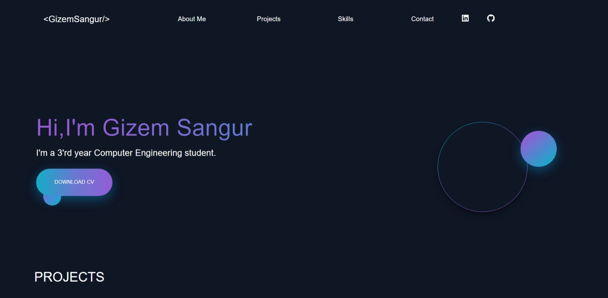
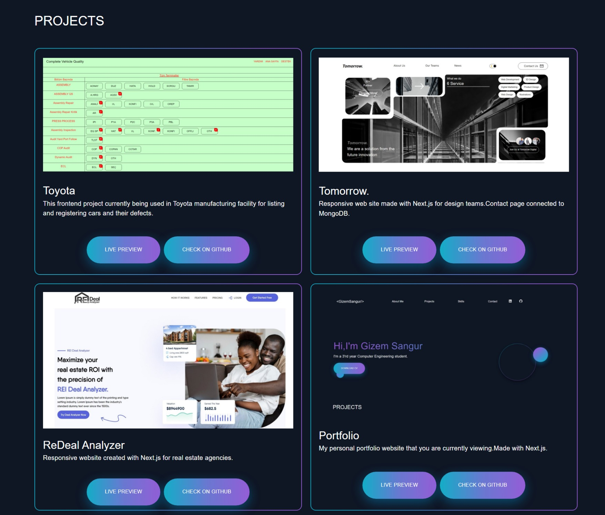
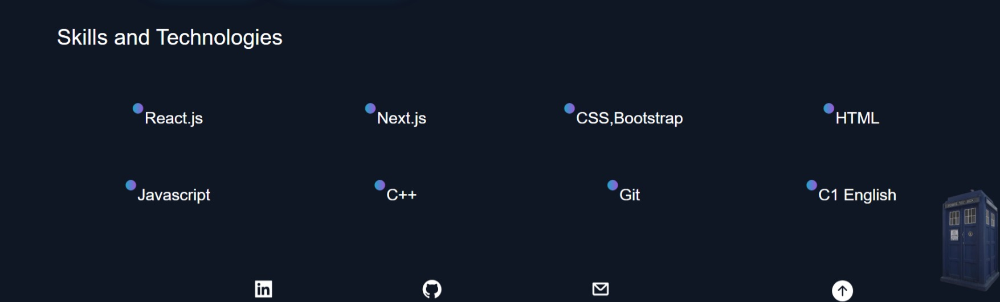
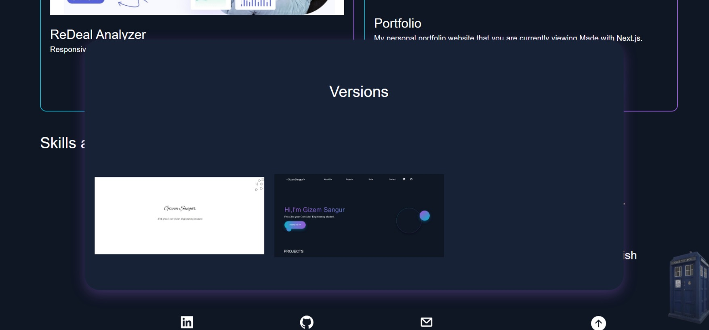

### My Portfolio WebSite

## About Me 

 Little informations about me. And you can download my CV from that button.

## Projects

In here you can see my projects. Also you can see their live previews and see github codes.

## Skills

 Here  you can look at couple skills that I have and technologies that I'm using.

## Versions

 And from the little TARDIS at the corner you can see old version of my portfolio website.

<a href="#top">Back to top</a>
